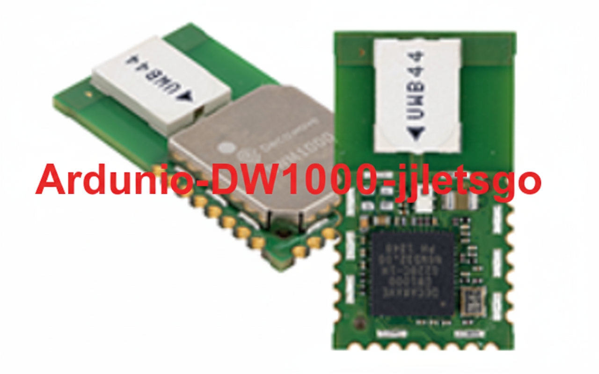

 

  

 

### Arduino library to use Decawave's [DW1000](https://www.decawave.com/product/dw1000-radio-ic/) IC and relative modules.

**Differences with F-Army/arduino-dw1000-ng**
------------ 
This is a fork of https://github.com/F-Army/arduino-dw1000-ng.

We've developed a Fast **RTLS system using 4 anchors**, including:

+ NLOS/LOS detection algorithm

+ Retry logic

+ Several filtering methods for RTLS

+ Added small delays to improve stability on the DWM1000 SPI bus

Features
------------
+ RTLS with 4 anchors (You can apply weighting techniques or even discard unreliable TWR range results if desired.)
   
+ Retry Logic (This is the biggest difference from the original arduino-dw1000-ng.
I modified the retry logic, which significantly increased RTLS speed!)
   
+ reduced delay (You can achieve higher speed by reducing delays or tuning RTLS parameters in this library. But should be careful, because too short delay could ruin the DWM1000 HW. I recommend u to read user manual when u wanna modify delay)
+ NLOS/LOS Detection (Includes a detection logic based on signal quality registers in the DWM1000 — for example, FP Power, Rx Power, FP Ampl, and SNR.)
   
+ Filtering Logic 
(Includes custom filtering functions for more stable position estimation.)
 

Devices
------------

Specific tested devices, whit related pinout, are inside the [Wiki](https://github.com/F-Army/arduino-dw1000-ng/wiki/Tested-hardware-boards).

Installation
------------
**Requires c++11 support**, Arduino IDE >= 1.6.6 support c++11.

 1. Get a ZIP file of the master branch or the latest release and save somewhere on your machine.
 2. Open your Arduino IDE and goto _Sketch_ / _Include Library_ / _Add .ZIP Library..._
 3. Select the downloaded ZIP file of the DW1000 library
 4. You should now see the library in the list and have access to the examples in the dedicated section of the IDE

Usage
-----
Check examples folder for basic usage.

The [Decawave documentation](https://github.com/F-Army/arduino-dw1000-ng/wiki/Decawave's-documentation) helps a lot in understanding this project, especially if you want to go deeper.

Contributors    
------------
<ul>
  <li><b>Jaeyun 'jjletsgo' Jung </b>:https://github.com/jjletsgo</li>
  <li><b>Yujin 'jjletsgo' Lee </b>:https://github.com/euzin3</li>
</ul>

License
-------
The project is under MIT (see [LICENSE.md](https://github.com/F-Army/arduino-dw1000Ng/blob/master/LICENSE.md))  
Some files are under a Dual Apache 2.0/MIT because this is a fork of [thotro/arduino-dw1000](https://github.com/thotro/arduino-dw1000)
